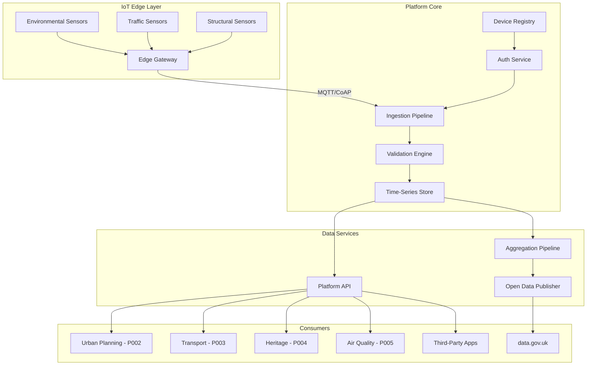

# Project Requirements: Smart City IoT Platform

> **Template Origin**: Official | **ArcKit Version**: 4.6.1 | **Command**: `/arckit.requirements`

## Document Control

| Field | Value |
|-------|-------|
| **Document ID** | ARC-001-REQ-v1.0 |
| **Document Type** | Requirements Specification |
| **Project** | Smart City IoT Platform (Project 001) |
| **Classification** | OFFICIAL |
| **Status** | DRAFT |
| **Version** | 1.0 |
| **Created Date** | 2026-03-28 |
| **Last Modified** | 2026-03-28 |
| **Review Cycle** | Quarterly |
| **Next Review Date** | 2026-06-28 |
| **Owner** | SRO, Smart City IoT Platform Programme |
| **Reviewed By** | PENDING |
| **Approved By** | PENDING |
| **Distribution** | Smart City IoT Programme Board, DLUHC Digital, NCSC, Local Authority Partners |

## Revision History

| Version | Date | Author | Changes | Approved By | Approval Date |
|---------|------|--------|---------|-------------|---------------|
| 1.0 | 2026-03-28 | ArcKit AI | Initial creation from `/arckit.requirements` command | PENDING | PENDING |

## Document Purpose

This document defines the business, functional, non-functional, integration, and data requirements for the Smart City IoT Platform — a shared national infrastructure for deploying and managing connected sensors across urban environments, serving as the foundational data layer for the SDG 11 programme.

---

## Executive Summary

### Business Context

UK local authorities are deploying IoT sensors independently, creating fragmented infrastructure with inconsistent security, incompatible data formats, and duplicated costs. Over 80 councils have some form of smart city deployment, but interoperability between them is effectively zero. This platform will provide a shared, secure, standards-based IoT infrastructure that local authorities can adopt to deploy sensors at 40-60% lower cost while contributing to a national urban data layer.

The platform directly supports the Levelling Up agenda by making smart city technology accessible to all councils — not just the largest and most digitally advanced. It underpins the other four SDG 11 projects by providing the sensor infrastructure for air quality monitoring (Project 005), transport data collection (Project 003), heritage structural monitoring (Project 004), and planning evidence gathering (Project 002).

### Objectives

- Provide a shared, multi-tenant IoT platform supporting 100,000+ sensors across 50+ local authorities
- Achieve ETSI EN 303 645 compliance for all connected devices via a published certification programme
- Publish aggregated sensor data as open data on data.gov.uk
- Reduce per-sensor TCO by 40-60% compared to independent local authority deployment
- Integrate with Ordnance Survey spatial data for geospatial sensor management

### Expected Outcomes

- 20+ local authorities onboarded with 10,000+ sensors in Year 1
- £30-50M cumulative savings across local authorities over 5 years
- National urban data layer enabling cross-authority analytics and benchmarking
- Zero critical IoT security incidents in first 2 years

### Project Scope

**In Scope**:
- IoT device management (provisioning, monitoring, firmware updates, decommissioning)
- Sensor data ingestion, processing, storage, and API access
- Device security certification programme (ETSI EN 303 645)
- Edge computing gateway management
- Open data publication pipeline
- Multi-tenant platform with local authority data isolation
- Integration APIs for consuming applications (Projects 002-005)

**Out of Scope**:
- Procurement of physical sensors (local authority responsibility)
- Citizen-facing applications (built by consuming projects)
- Specific domain analytics (air quality models, transport algorithms — handled by respective projects)
- CCTV or facial recognition capabilities (explicitly excluded)

---

## Stakeholders

| Stakeholder | Role | Organisation | Involvement Level |
|-------------|------|--------------|-------------------|
| SRO | Programme Sponsor | DLUHC | Decision maker |
| DLUHC CDO | Digital strategy | DLUHC | Architecture governance |
| NCSC Liaison | IoT security assurance | NCSC | Security review and certification |
| LA Digital Leads | Platform adopters | Local Authorities | Requirements input, user testing |
| Geospatial Commission | Spatial data strategy | Cabinet Office | Spatial standards alignment |
| ICO Representative | Data protection | ICO | Privacy review |
| IoT Industry Panel | Device standards | Industry | Interoperability standards |

---

## Business Requirements

### BR-001: Shared Multi-Tenant IoT Infrastructure

**Description**: Provide a shared IoT platform that multiple local authorities can use simultaneously, with logical data isolation between tenants, while enabling cross-authority data sharing for agreed use cases.

**Rationale**: Eliminates duplication of IoT infrastructure across 333 English local authorities, reducing per-authority costs by 40-60%.

**Success Criteria**:
- Platform supports 50+ concurrent local authority tenants
- Each tenant's data is logically isolated with configurable sharing policies
- Cost per sensor per year demonstrated at £60-90 (vs. £150-200 independent baseline)

**Priority**: MUST_HAVE
**Stakeholder**: LA Chief Executives, DLUHC CDO

---

### BR-002: ETSI EN 303 645 Device Security Compliance

**Description**: All devices connected to the platform must comply with ETSI EN 303 645 baseline security requirements, verified through a published device certification programme.

**Rationale**: Government IoT deployments in public infrastructure must set the gold standard for IoT security (NCSC requirement).

**Success Criteria**:
- Device certification programme published and accessible to manufacturers
- 100% of connected device types certified compliant before deployment
- No universal default passwords on any connected device

**Priority**: MUST_HAVE
**Stakeholder**: NCSC, DLUHC SIRO

---

### BR-003: Open Data Publication

**Description**: Publish aggregated, non-personal sensor data as open data on data.gov.uk, enabling transparency and third-party innovation.

**Rationale**: Builds citizen trust, demonstrates public value, and supports the Technology Code of Practice open data mandate.

**Success Criteria**:
- Minimum 10 aggregated datasets published within 6 months
- Data published under Open Government Licence
- API access with documented schema for third-party developers

**Priority**: SHOULD_HAVE
**Stakeholder**: DLUHC CDO, Geospatial Commission

---

### BR-004: Levelling Up — Accessibility for All Councils

**Description**: The platform must be usable by local authorities of all sizes and digital maturity levels, from London boroughs to small district councils with limited IT resources.

**Rationale**: Supports the Levelling Up agenda — smart city benefits must not be limited to the most digitally advanced authorities.

**Success Criteria**:
- Self-service onboarding completed within 5 working days
- No specialist IoT expertise required for basic sensor deployment
- Tiered support model: self-service, assisted, and fully managed options

**Priority**: MUST_HAVE
**Stakeholder**: Minister for Local Government, LA Chief Executives

---

## Functional Requirements

### User Personas

#### Persona 1: Local Authority IoT Manager

- **Role**: Digital/IT team lead responsible for smart city technology
- **Goals**: Deploy and manage sensors cost-effectively, integrate data with local systems
- **Pain Points**: Managing multiple vendor platforms, inconsistent data formats, security patching across device fleets
- **Technical Proficiency**: Medium-High

#### Persona 2: Local Authority Non-Technical Officer

- **Role**: Environmental health officer, highway inspector, or parks officer
- **Goals**: Access sensor data for operational decisions without IT support
- **Pain Points**: Cannot access real-time sensor data without requesting IT team extracts
- **Technical Proficiency**: Low-Medium

#### Persona 3: Platform Administrator

- **Role**: DLUHC platform operations team
- **Goals**: Manage multi-tenant platform, onboard new authorities, monitor platform health
- **Pain Points**: Scaling across heterogeneous device fleets, managing firmware updates
- **Technical Proficiency**: High

---

### Functional Requirements Detail

#### FR-001: Device Provisioning and Onboarding

**Description**: The platform must support automated provisioning of IoT devices, including identity generation, certificate issuance, and initial configuration deployment.

**Relates To**: BR-001, BR-002

**Acceptance Criteria**:
- [ ] Given a certified device type, when a new device is registered, then a unique identity and device certificate are generated automatically
- [ ] Given a device fleet of 1,000 devices, when bulk provisioning is initiated, then all devices are provisioned within 2 hours
- [ ] Given a device that fails certification checks, when provisioning is attempted, then the device is rejected with a clear error message

**Data Requirements**:
- **Inputs**: Device type, manufacturer, firmware version, deployment location (lat/long), tenant (local authority)
- **Outputs**: Device ID, certificate, configuration profile
- **Validations**: ETSI EN 303 645 certification status verified before provisioning

**Priority**: MUST_HAVE
**Complexity**: HIGH

---

#### FR-002: Real-Time Sensor Data Ingestion

**Description**: The platform must ingest sensor telemetry from 100,000+ devices in real time, supporting multiple IoT protocols (MQTT, CoAP, LwM2M, HTTPS).

**Relates To**: BR-001

**Acceptance Criteria**:
- [ ] Given 100,000 sensors sending data at 1-minute intervals, when all are active simultaneously, then 99.9% of readings are ingested within 30 seconds
- [ ] Given a sensor sending data via MQTT, when the message is published, then it is validated, stored, and available via API within 30 seconds
- [ ] Given a malformed sensor payload, when received, then the system logs the error, increments an error counter, and does not corrupt the data store

**Priority**: MUST_HAVE
**Complexity**: HIGH

---

#### FR-003: Device Fleet Management

**Description**: The platform must provide fleet management capabilities including firmware update deployment, device health monitoring, remote diagnostics, and secure decommissioning.

**Relates To**: BR-002

**Acceptance Criteria**:
- [ ] Given a critical firmware security patch, when deployed to a device fleet of 10,000, then 95% of devices are updated within 24 hours
- [ ] Given a device that has not reported in 4 hours, when the health check runs, then an alert is generated and the device is marked offline
- [ ] Given a device being decommissioned, when the decommission workflow is triggered, then all credentials are revoked and stored data is handled per retention policy

**Priority**: MUST_HAVE
**Complexity**: HIGH

---

#### FR-004: Spatial Sensor Management

**Description**: The platform must provide a map-based interface for managing sensor locations, using Ordnance Survey spatial data and UPRN referencing.

**Relates To**: BR-001, BR-004

**Acceptance Criteria**:
- [ ] Given a sensor deployment, when the location is registered, then it is displayed on an OS-based map with UPRN/USRN association
- [ ] Given a map view of a local authority area, when filtered by sensor type, then all matching sensors are displayed with status indicators
- [ ] Given a spatial query (bounding box or polygon), when executed via API, then all sensors within the area are returned with current readings

**Priority**: SHOULD_HAVE
**Complexity**: MEDIUM

---

#### FR-005: Multi-Tenant Data Isolation

**Description**: The platform must enforce strict logical data isolation between local authority tenants, with configurable data sharing policies for cross-authority use cases.

**Relates To**: BR-001

**Acceptance Criteria**:
- [ ] Given Tenant A's data, when Tenant B queries the platform, then Tenant A's data is not visible unless explicitly shared
- [ ] Given a cross-authority data sharing agreement, when configured, then only specified data types are shared with specified tenants
- [ ] Given an administrator query, when run at platform level, then tenant data is accessible only with appropriate authorization

**Priority**: MUST_HAVE
**Complexity**: HIGH

---

#### FR-006: Edge Computing Gateway Management

**Description**: The platform must manage edge computing gateways deployed in street furniture, enabling local data pre-processing, protocol translation, and store-and-forward during connectivity outages.

**Relates To**: BR-001

**Acceptance Criteria**:
- [ ] Given a connectivity outage, when the edge gateway loses connection for up to 4 hours, then sensor data is buffered locally and forwarded on reconnection
- [ ] Given a data reduction rule, when configured at the edge, then raw sensor readings are aggregated before transmission (e.g., 1-second readings aggregated to 1-minute averages)
- [ ] Given an edge gateway, when a configuration update is deployed, then the update is applied within 30 minutes

**Priority**: SHOULD_HAVE
**Complexity**: HIGH

---

#### FR-007: Open Data Publication Pipeline

**Description**: The platform must automatically aggregate sensor data, apply statistical disclosure control, and publish datasets to data.gov.uk via API.

**Relates To**: BR-003

**Acceptance Criteria**:
- [ ] Given hourly sensor readings, when the aggregation pipeline runs, then daily/weekly/monthly summaries are generated and published
- [ ] Given aggregated data with fewer than 5 contributing sensors in a cell, when disclosure control is applied, then the cell is suppressed to prevent re-identification
- [ ] Given a published dataset, when accessed via data.gov.uk, then metadata includes provenance, update frequency, and licence (OGL)

**Priority**: SHOULD_HAVE
**Complexity**: MEDIUM

---

## Non-Functional Requirements (NFRs)

### Performance Requirements

#### NFR-P-001: Sensor Data Ingestion Throughput

**Requirement**: Platform must sustain ingestion of 100,000 sensor readings per minute (peak: 250,000/minute during burst events) with < 30 second end-to-end latency from device to API availability.

**Load Conditions**:
- Normal: 100,000 sensors at 1-minute intervals = 100K readings/minute
- Peak: 250,000 readings/minute (sensor burst + backfill after outage)
- Data volume: ~50 GB/day at full scale

**Priority**: CRITICAL

---

#### NFR-P-002: API Response Time

**Requirement**: Platform APIs must respond within 200ms at p95 for point queries (single sensor latest reading) and within 2 seconds at p95 for aggregate queries (time-series, spatial aggregate).

**Priority**: HIGH

---

### Security Requirements

#### NFR-SEC-001: ETSI EN 303 645 Compliance

**Requirement**: All connected devices must comply with all 13 provisions of ETSI EN 303 645, verified before onboarding.

**Key Provisions**:
- No universal default passwords
- Implement a means to manage reports of vulnerabilities
- Keep software updated
- Securely store sensitive security parameters
- Communicate securely (TLS 1.3+)
- Minimise exposed attack surfaces
- Ensure software integrity
- Ensure personal data is secure
- Make systems resilient to outages
- Examine system telemetry data
- Make it easy for users to delete user data
- Make installation and maintenance easy
- Validate input data

**Priority**: CRITICAL

---

#### NFR-SEC-002: Network Segmentation

**Requirement**: IoT device traffic, platform management traffic, and API consumer traffic must be on separate network segments with firewall rules enforcing least-privilege access between segments.

**Priority**: CRITICAL

---

#### NFR-SEC-003: Device Identity and Authentication

**Requirement**: Every device must have a unique identity with certificate-based mutual authentication. No shared credentials across devices.

**Priority**: CRITICAL

---

### Availability Requirements

#### NFR-A-001: Platform Availability

**Requirement**: Core platform (data ingestion, storage, API) must achieve 99.9% availability (8.7 hours maximum downtime per year).

**RTO**: 1 hour
**RPO**: 5 minutes (sensor data), 0 (configuration data)

**Priority**: CRITICAL

---

### Scalability Requirements

#### NFR-S-001: Horizontal Scaling

**Requirement**: Platform must scale horizontally from 1,000 sensors (pilot) to 100,000+ sensors (full deployment) without architecture changes.

**Growth Projections**:
- Year 1: 10,000 sensors, 20 authorities
- Year 2: 50,000 sensors, 35 authorities
- Year 3: 100,000+ sensors, 50+ authorities

**Priority**: CRITICAL

---

## Integration Requirements

### INT-001: Integration with Ordnance Survey APIs

**Purpose**: Provide authoritative spatial base layer for sensor location management and spatial queries.

**Integration Type**: Real-time API (OS Data Hub)
**Data Exchanged**: OS MasterMap, UPRN/USRN lookups, boundary data
**Authentication**: API key (OS Data Hub)
**Priority**: MUST_HAVE

---

### INT-002: Integration with Air Quality Monitoring Network (Project 005)

**Purpose**: Provide environmental sensor data to the air quality platform for pollution monitoring.

**Integration Type**: Event-driven (real-time sensor telemetry stream)
**Data Exchanged**: Air quality sensor readings (NO2, PM2.5, PM10, O3) with location, timestamp, device metadata
**Authentication**: Mutual TLS, OAuth 2.0
**Priority**: MUST_HAVE

---

### INT-003: Integration with Heritage Asset Management (Project 004)

**Purpose**: Provide structural monitoring sensor data for Heritage at Risk sites.

**Integration Type**: Event-driven (alerting) + API (historical data)
**Data Exchanged**: Vibration, moisture, temperature readings from heritage site sensors
**Authentication**: Mutual TLS, OAuth 2.0
**Priority**: SHOULD_HAVE

---

### INT-004: Integration with data.gov.uk

**Purpose**: Publish aggregated open data datasets.

**Integration Type**: API (CKAN API)
**Data Exchanged**: Aggregated sensor datasets with INSPIRE-compliant metadata
**Authentication**: API key
**Priority**: SHOULD_HAVE

---

## Data Requirements

### Data Entities

#### Entity: Sensor Device

| Attribute | Type | Required | Description | Constraints |
|-----------|------|----------|-------------|-------------|
| device_id | UUID | Yes | Unique device identifier | Primary key |
| device_type | Enum | Yes | Sensor category | [environmental, traffic, structural, utility] |
| manufacturer | String(255) | Yes | Device manufacturer | Not null |
| model | String(255) | Yes | Device model | Not null |
| firmware_version | String(50) | Yes | Current firmware | Semver format |
| etsi_certification_id | String(100) | Yes | ETSI EN 303 645 cert reference | Validated against cert registry |
| location | Geometry(Point) | Yes | WGS84 coordinates | SRID 4326 |
| location_osgb | Geometry(Point) | No | OSGB36 coordinates | SRID 27700 |
| uprn | String(12) | No | Unique Property Reference Number | Valid UPRN format |
| tenant_id | UUID | Yes | Owning local authority | Foreign key to Tenant |
| status | Enum | Yes | Device status | [provisioning, active, offline, maintenance, decommissioned] |
| deployed_date | Timestamp | Yes | Deployment date | Not null |
| last_seen | Timestamp | Yes | Last telemetry received | Indexed |

**Data Volume**: 100,000+ records at full scale
**Data Classification**: OFFICIAL
**Retention**: Lifetime of device + 2 years after decommissioning

#### Entity: Sensor Reading

| Attribute | Type | Required | Description | Constraints |
|-----------|------|----------|-------------|-------------|
| reading_id | UUID | Yes | Unique reading identifier | Primary key |
| device_id | UUID | Yes | Source device | Foreign key to Sensor Device |
| timestamp | Timestamp | Yes | Reading timestamp (UTC) | Indexed, millisecond precision |
| measurement_type | Enum | Yes | What was measured | [temperature, humidity, NO2, PM25, PM10, traffic_count, vibration, noise, light] |
| value | Decimal | Yes | Measurement value | Range validated per type |
| unit | String(20) | Yes | Measurement unit | [celsius, percent, ug_m3, count, mm_s, dB, lux] |
| quality_flag | Enum | Yes | Data quality indicator | [valid, suspect, invalid, calibration] |

**Data Volume**: ~50 GB/day at full scale (100K sensors, 1-minute intervals)
**Data Classification**: OFFICIAL (aggregated: PUBLIC)
**Retention**: Hot: 90 days, Warm: 2 years, Cold: 7 years

---

### Data Flow Diagram

---

## Constraints and Assumptions

### Technical Constraints

**TC-1**: All data processing and storage must occur within UK sovereign data centres (UK GDPR, data sovereignty).
**TC-2**: Platform must integrate with existing local authority network infrastructure (no requirement for dedicated WAN connections).
**TC-3**: IoT protocols limited to MQTT v5, CoAP, LwM2M, and HTTPS (no proprietary protocols).

### Business Constraints

**BC-1**: Budget cap of £18M capital over 3 years (DLUHC allocation).
**BC-2**: Platform must be operational (MVP) within 12 months for early adopter authorities.
**BC-3**: Must not mandate specific device vendors — open market for certified devices.

### Assumptions

**A-1**: Local authorities will procure their own sensor hardware (platform provides infrastructure, not devices).
**A-2**: Cellular connectivity (4G/5G) available at sensor deployment locations (or local authority provides alternative backhaul).
**A-3**: ETSI EN 303 645 certification process can be established within 6 months with NCSC support.

---

## Approval

### Requirements Review

| Reviewer | Role | Status | Date | Comments |
|----------|------|--------|------|----------|
| SRO | Programme Sponsor | [ ] Approved | PENDING | |
| DLUHC CDO | Digital Strategy | [ ] Approved | PENDING | |
| NCSC Liaison | Security | [ ] Approved | PENDING | |
| ICO Representative | Privacy | [ ] Approved | PENDING | |

---

## External References

| Document | Type | Source | Key Extractions | Path |
|----------|------|--------|-----------------|------|
| ETSI EN 303 645 | Standard | ETSI | 13 IoT security provisions | N/A — external reference |
| NCSC Connected Places | Guidance | NCSC | Smart city security principles | N/A — external reference |
| OS Data Hub API | API | Ordnance Survey | Spatial data services | N/A — external reference |

---

**Generated by**: ArcKit `/arckit.requirements` command
**Generated on**: 2026-03-28
**ArcKit Version**: 4.6.1
**Project**: Smart City IoT Platform (Project 001)
**Model**: Claude Opus 4.6
