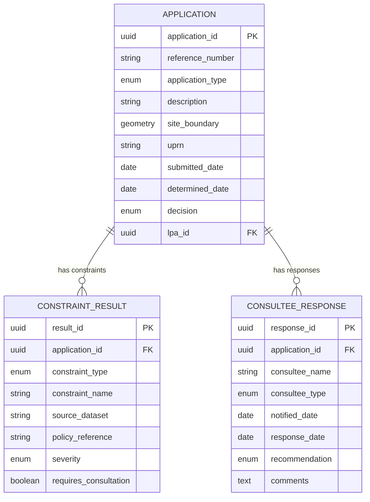

# Project Requirements: Urban Planning Analytics

> **Template Origin**: Official | **ArcKit Version**: 4.6.1 | **Command**: `/arckit.requirements`

## Document Control

| Field | Value |
|-------|-------|
| **Document ID** | ARC-002-REQ-v1.0 |
| **Document Type** | Requirements Specification |
| **Project** | Urban Planning Analytics (Project 002) |
| **Classification** | OFFICIAL |
| **Status** | DRAFT |
| **Version** | 1.0 |
| **Created Date** | 2026-03-28 |
| **Last Modified** | 2026-03-28 |
| **Review Cycle** | Quarterly |
| **Next Review Date** | 2026-06-28 |
| **Owner** | SRO, Urban Planning Analytics Programme |
| **Reviewed By** | PENDING |
| **Approved By** | PENDING |
| **Distribution** | Urban Planning Analytics Programme Board, DLUHC Planning Directorate, Historic England, CDDO |

## Revision History

| Version | Date | Author | Changes | Approved By | Approval Date |
|---------|------|--------|---------|-------------|---------------|
| 1.0 | 2026-03-28 | ArcKit AI | Initial creation from `/arckit.requirements` command | PENDING | PENDING |

## Document Purpose

This document defines requirements for the Urban Planning Analytics platform — a data-driven spatial planning and development control system enabling local planning authorities to make faster, more consistent, and better-evidenced planning decisions aligned with the National Planning Policy Framework (NPPF).

---

## Executive Summary

### Business Context

The English planning system processes over 450,000 planning applications annually, with local planning authorities under severe resource pressure (25% vacancy rate for planning officers, 40% staff reduction since 2010). Planning decisions are largely manual — officers check constraints across multiple systems, cross-reference NPPF policies, chase statutory consultees, and produce reports. This platform will automate constraint checking, integrate heritage data (Project 004), provide NPPF policy analysis, and publish structured planning data per DLUHC standards.

### Objectives

- Automate planning constraint checking (heritage, flood, ecology, highways, TPO) reducing officer time by 2-3 hours per application
- Integrate NHLE heritage data to achieve zero heritage constraint oversights
- Publish structured planning data from 50+ LPAs in DLUHC data standard format
- Reduce minor application determination time from 8 weeks to 5 weeks
- Provide accessible digital consultation tools for community engagement

### Expected Outcomes

- 30% reduction in planning officer time per application
- Zero heritage constraint oversights in platform-assisted decisions
- 50 LPAs publishing structured planning data within 12 months
- Measurable improvement in consultation response rates through digital tools

### Project Scope

**In Scope**:
- Automated planning constraint checking (spatial overlay analysis)
- NHLE heritage data integration (Project 004 API)
- NPPF policy lookup and relevance matching
- Statutory consultee notification and response management
- Structured planning data publication (DLUHC data standards)
- Community consultation digital interface
- Integration with existing back-office planning systems (Idox Uniform, NEC/Civica DEF)

**Out of Scope**:
- Automated planning decisions (platform supports, not replaces, professional judgement)
- Building control applications
- Planning enforcement case management
- Planning appeals (PINS responsibility)

---

## Business Requirements

### BR-001: Automated Planning Constraint Checking

**Description**: Automatically identify all statutory and non-statutory constraints affecting a planning application site, including heritage (listed buildings, conservation areas, scheduled monuments), flood risk zones, ecological designations (SSSI, SAC, SPA), Tree Preservation Orders, and highways constraints.

**Rationale**: Planning officers currently check 15-20 constraint sources manually per application, taking 2-3 hours. Automation eliminates this manual overhead and reduces the risk of missed constraints.

**Success Criteria**:
- All statutory constraints identified with 100% recall (no missed constraints)
- Constraint report generated within 10 seconds of site boundary input
- Integration with NHLE, Environment Agency flood maps, Natural England designations

**Priority**: MUST_HAVE
**Stakeholder**: LPA Planning Officers, Historic England

---

### BR-002: Heritage Constraint Integration

**Description**: Integrate authoritative heritage data from the National Heritage List for England (Project 004 API) to automatically identify listed buildings, conservation areas, scheduled monuments, and registered parks and gardens affected by or adjacent to planning application sites.

**Rationale**: Heritage constraint oversights lead to unlawful damage to protected heritage assets. Estimated 3-5% oversight rate in current manual processes.

**Success Criteria**:
- Zero heritage constraint oversights verified by annual audit
- Listed Building Consent requirement automatically flagged
- Setting analysis triggered for applications within 100m of Grade I/II* listed buildings

**Priority**: MUST_HAVE
**Stakeholder**: Historic England, Conservation Officers

---

### BR-003: Structured Planning Data Publication

**Description**: Enable local planning authorities to publish planning application data in DLUHC data standard format, supporting national planning data infrastructure.

**Rationale**: The Levelling Up and Regeneration Act 2023 introduced data duties for planning. Consistent, structured data enables national policy monitoring, research, and transparency.

**Success Criteria**:
- 50 LPAs publishing compliant structured data within 12 months
- Data completeness score >90% per LPA
- Publication lag <24 hours from decision

**Priority**: MUST_HAVE
**Stakeholder**: DLUHC Planning Data Team, Minister

---

### BR-004: Accessible Community Consultation

**Description**: Provide digital consultation tools that enable community members, parish councils, and neighbourhood forums to view, understand, and respond to planning applications — accessible on mobile devices and meeting WCAG 2.2 AA.

**Rationale**: Democratic participation in planning is a statutory right. Digital tools must enhance, not diminish, community engagement, reaching beyond the traditional letter-writing demographic.

**Success Criteria**:
- Consultation interface accessible on mobile devices (responsive design)
- Plain-language application summaries generated automatically
- Response submission achievable in under 5 minutes
- WCAG 2.2 Level AA compliance verified

**Priority**: SHOULD_HAVE
**Stakeholder**: Community and Parish Councils, Neighbourhood Forums

---

## Functional Requirements

### User Personas

#### Persona 1: Planning Officer (Case Officer)

- **Role**: Processes planning applications, makes recommendations, writes reports
- **Goals**: Process applications faster with better evidence, never miss a constraint
- **Pain Points**: 15-20 systems to check per application, chasing consultees, manual report writing
- **Technical Proficiency**: Medium

#### Persona 2: Conservation Officer

- **Role**: Assesses heritage impact of planning applications
- **Goals**: Accurate heritage data, efficient LBC workflow, amenity society consultation management
- **Pain Points**: Incomplete NHLE data, manual consultee tracking, split across multiple authorities
- **Technical Proficiency**: Medium

#### Persona 3: Community Member / Parish Councillor

- **Role**: Reviews and comments on local planning applications
- **Goals**: Understand what's proposed, submit informed comments, track decision
- **Pain Points**: PDFs of technical drawings, jargon-heavy descriptions, no feedback on outcome
- **Technical Proficiency**: Low

---

### Functional Requirements Detail

#### FR-001: Site Boundary Constraint Analysis

**Description**: Given a site boundary (polygon), the system must identify all intersecting or adjacent statutory and non-statutory planning constraints within configurable buffer distances.

**Relates To**: BR-001, BR-002

**Acceptance Criteria**:
- [ ] Given a site polygon, when constraint analysis is run, then all intersecting constraints are returned with constraint type, source, and applicable policy references
- [ ] Given a site within 100m of a Grade I listed building, when analysis is run, then a heritage setting assessment requirement is flagged
- [ ] Given a site in Flood Zone 3, when analysis is run, then Sequential Test and Exception Test requirements are identified

**Priority**: MUST_HAVE
**Complexity**: HIGH

---

#### FR-002: NPPF Policy Relevance Engine

**Description**: Given a planning application type and site constraints, the system must identify relevant NPPF paragraphs, local plan policies, and supplementary planning documents.

**Relates To**: BR-001

**Acceptance Criteria**:
- [ ] Given a housing application in a conservation area, when policy lookup is run, then NPPF paragraphs 199-208 (heritage) and relevant local plan heritage policies are returned
- [ ] Given a change of policy (NPPF revision), when updated in the system, then all subsequent analyses use the updated policy set
- [ ] Given a local plan adoption, when the plan is loaded, then policies are available for constraint analysis within 5 working days

**Priority**: SHOULD_HAVE
**Complexity**: HIGH

---

#### FR-003: Statutory Consultee Management

**Description**: The system must automatically notify statutory consultees based on application type and constraints, track response deadlines, send reminders, and record responses.

**Relates To**: BR-001, BR-002

**Acceptance Criteria**:
- [ ] Given an application affecting a listed building, when submitted, then the relevant amenity societies are notified with application details within 1 working day
- [ ] Given a consultee has not responded within 14 days, when the reminder runs, then a follow-up notification is sent
- [ ] Given a consultee response, when received, then it is attached to the application record with timestamp and linked to the constraint that triggered consultation

**Priority**: MUST_HAVE
**Complexity**: MEDIUM

---

#### FR-004: Planning Data Standard Export

**Description**: The system must export planning application data in DLUHC Planning Data Standard format (JSON-LD) with INSPIRE-compliant spatial metadata.

**Relates To**: BR-003

**Acceptance Criteria**:
- [ ] Given a determined application, when exported, then the output conforms to the DLUHC Planning Data Standard schema
- [ ] Given a batch export for an LPA, when run, then all applications for the specified period are included with >90% field completeness
- [ ] Given a real-time publication feed, when an application status changes, then the update is published within 1 hour

**Priority**: MUST_HAVE
**Complexity**: MEDIUM

---

#### FR-005: Community Consultation Portal

**Description**: A public-facing portal for viewing planning applications with plain-language summaries, site maps, 3D visualisations (where available), and structured comment submission.

**Relates To**: BR-004

**Acceptance Criteria**:
- [ ] Given a planning application, when viewed by a community member, then a plain-language summary, site map, and key documents are displayed
- [ ] Given a mobile device, when accessing the consultation portal, then the interface is fully responsive and usable
- [ ] Given a submitted comment, when received, then the commenter receives confirmation and can track the application outcome

**Priority**: SHOULD_HAVE
**Complexity**: MEDIUM

---

## Non-Functional Requirements

### Performance Requirements

#### NFR-P-001: Constraint Analysis Response Time

**Requirement**: Constraint analysis for a single site must complete within 10 seconds at p95, including heritage, flood, ecology, and highways constraint layers.

**Priority**: HIGH

---

### Security Requirements

#### NFR-SEC-001: Planning Data Access Control

**Requirement**: Role-based access control with separate permissions for planning officers (full access), consultees (application-specific access), and public (published data only). Embargoed applications (e.g., sensitive sites) must be access-restricted until publication.

**Priority**: CRITICAL

---

### Compliance Requirements

#### NFR-C-001: DLUHC Planning Data Standards

**Requirement**: All published planning data must conform to DLUHC Planning Data Standards as specified in the Levelling Up and Regeneration Act 2023 data regulations.

**Priority**: CRITICAL

---

#### NFR-C-002: WCAG 2.2 Level AA

**Requirement**: All citizen-facing interfaces (consultation portal, application tracking) must meet WCAG 2.2 Level AA.

**Priority**: CRITICAL

---

## Integration Requirements

### INT-001: Integration with Heritage Asset Management (Project 004)

**Purpose**: Real-time heritage constraint data from NHLE for automated constraint checking.
**Integration Type**: Real-time API
**Data Exchanged**: Listed building records, conservation area boundaries, scheduled monument locations
**Priority**: MUST_HAVE

---

### INT-002: Integration with Existing Back-Office Planning Systems

**Purpose**: Bi-directional integration with Idox Uniform, NEC/Civica DEF, and other LPA case management systems.
**Integration Type**: API (REST) with configurable field mapping
**Data Exchanged**: Application records, constraint analysis results, consultee responses
**Priority**: MUST_HAVE

---

### INT-003: Integration with Environment Agency Flood Data

**Purpose**: Flood risk zone data for automated constraint checking.
**Integration Type**: API (EA Flood Map API)
**Data Exchanged**: Flood Zone 2, 3, 3b boundaries; surface water flood risk
**Priority**: MUST_HAVE

---

### INT-004: Integration with Ordnance Survey

**Purpose**: Authoritative base mapping and address/street referencing.
**Integration Type**: API (OS Data Hub)
**Data Exchanged**: OS MasterMap, UPRN, USRN, boundary data
**Priority**: MUST_HAVE

---

## Data Requirements

### Planning Application Data Model

---

## Constraints and Assumptions

### Technical Constraints

**TC-1**: Must integrate with existing Idox and NEC/Civica planning systems — cannot mandate replacement.
**TC-2**: Spatial data must use OSGB36 (EPSG:27700) for internal processing and WGS84 (EPSG:4326) for API output.
**TC-3**: Heritage data sourced exclusively from NHLE (Project 004) — no independent heritage database.

### Business Constraints

**BC-1**: Budget cap of £12M capital over 3 years.
**BC-2**: Must not mandate changes to the statutory planning process or consultation periods.
**BC-3**: Platform must support both the current NPPF and any future revisions without re-architecture.

---

## External References

| Document | Type | Source | Key Extractions | Path |
|----------|------|--------|-----------------|------|
| NPPF | Policy | DLUHC | Planning decision framework | N/A — external reference |
| DLUHC Planning Data Standards | Standard | DLUHC | Structured data model | N/A — external reference |
| Levelling Up and Regeneration Act 2023 | Legislation | legislation.gov.uk | Planning data duties | N/A — external reference |

---

**Generated by**: ArcKit `/arckit.requirements` command
**Generated on**: 2026-03-28
**ArcKit Version**: 4.6.1
**Project**: Urban Planning Analytics (Project 002)
**Model**: Claude Opus 4.6
