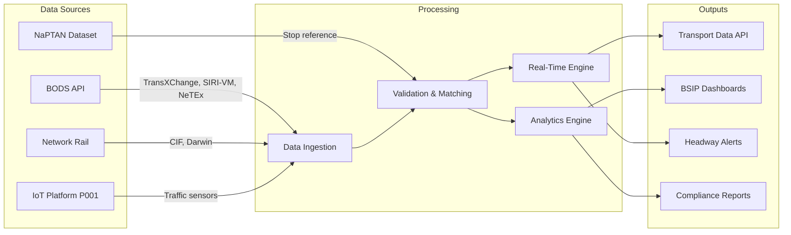

# Project Requirements: Public Transport Optimisation

> **Template Origin**: Official | **ArcKit Version**: 4.6.1 | **Command**: `/arckit.requirements`

## Document Control

| Field | Value |
|-------|-------|
| **Document ID** | ARC-003-REQ-v1.0 |
| **Document Type** | Requirements Specification |
| **Project** | Public Transport Optimisation (Project 003) |
| **Classification** | OFFICIAL |
| **Status** | DRAFT |
| **Version** | 1.0 |
| **Created Date** | 2026-03-28 |
| **Last Modified** | 2026-03-28 |
| **Review Cycle** | Quarterly |
| **Next Review Date** | 2026-06-28 |
| **Owner** | SRO, Public Transport Optimisation Programme |
| **Reviewed By** | PENDING |
| **Approved By** | PENDING |
| **Distribution** | Public Transport Programme Board, DfT, Combined Authorities, CDDO |

## Revision History

| Version | Date | Author | Changes | Approved By | Approval Date |
|---------|------|--------|---------|-------------|---------------|
| 1.0 | 2026-03-28 | ArcKit AI | Initial creation from `/arckit.requirements` command | PENDING | PENDING |

## Document Purpose

This document defines requirements for the Public Transport Optimisation platform — a multi-modal transport planning and scheduling system enabling combined authorities and DfT to improve bus, rail, and active travel services through data-driven network optimisation, real-time schedule management, and open data publication via BODS.

---

## Executive Summary

### Business Context

Bus patronage outside London has declined 30% since 2010, with services becoming less reliable and coverage shrinking. The Bus Services Act 2017 introduced mandatory open data requirements (BODS) and franchising powers, but compliance remains at approximately 72% nationally. Combined authorities with Bus Service Improvement Plans need analytical tools to plan networks, monitor operator performance, and make evidence-based decisions about service changes. Currently, each authority attempts to build its own analytics capability at costs of £1-5M, with inconsistent results.

### Objectives

- Achieve 95%+ BODS compliance across all operators in participating areas
- Reduce passenger wait time variability (Excess Wait Time) by 20%
- Provide integrated multi-modal transport data platform serving 10+ transport authorities
- Enable data-driven Bus Service Improvement Plan monitoring and reporting
- Publish all transport data in BODS-compliant formats (TransXChange, SIRI-VM, NeTEx, GTFS-RT)

### Expected Outcomes

- 20% reduction in Excess Wait Time in participating areas within 18 months
- 95%+ BODS compliance (up from 72% baseline)
- 10+ transport authorities using integrated multi-modal analytics
- Measurable improvement in National Bus Passenger Survey satisfaction scores

### Project Scope

**In Scope**:
- BODS data ingestion, validation, and quality monitoring
- Multi-modal data integration (bus, rail, tram, active travel)
- Real-time schedule optimisation and headway management tools
- BSIP performance monitoring dashboards
- NaPTAN stop/station reference management
- Passenger information API for journey planners
- Operator performance reporting and benchmarking

**Out of Scope**:
- Passenger-facing journey planning applications (Traveline and third-party responsibility)
- Ticketing and payment systems
- Traffic signal priority hardware
- Rail franchise management (ORR/DfT Rail responsibility)

---

## Business Requirements

### BR-001: BODS Data Quality and Compliance

**Description**: Ingest, validate, and monitor bus operator data published through the Bus Open Data Service (BODS), providing compliance scoring and quality reporting per operator and per authority area.

**Rationale**: BODS compliance is mandatory but patchy (72%). Validated, quality-scored data is essential for all downstream analytics.

**Success Criteria**:
- BODS data from all operators in participating areas ingested within 5 minutes of publication
- Data quality scores calculated per operator covering completeness, accuracy, and timeliness
- Compliance reports generated per authority area for DfT and Enhanced Partnership monitoring

**Priority**: MUST_HAVE
**Stakeholder**: DfT BODS Team, Combined Authority Transport Directors

---

### BR-002: Multi-Modal Transport Data Integration

**Description**: Integrate bus (BODS), rail (Network Rail/TOC feeds), tram (operator feeds), and active travel data (cycle hire, walking routes) into a unified multi-modal transport data model referenced against NaPTAN stops and NPTG localities.

**Rationale**: Passengers travel multi-modally. Network planning that only considers bus in isolation cannot optimise the passenger journey.

**Success Criteria**:
- Bus, rail, and tram data integrated for participating areas
- NaPTAN codes used consistently across all modes
- Interchange connection times modelled between modes at shared stops/stations
- Active travel data (cycle routes, walking times) integrated for first/last mile analysis

**Priority**: MUST_HAVE
**Stakeholder**: Combined Authority Transport Directors, TfL

---

### BR-003: Real-Time Schedule Optimisation

**Description**: Provide real-time tools for combined authorities and operators to optimise service headways, manage disruption, and reduce passenger wait time variability using AVL (Automatic Vehicle Location) data.

**Rationale**: Bus service reliability is the primary driver of passenger dissatisfaction. Real-time headway management can reduce Excess Wait Time by 20% without additional vehicles.

**Success Criteria**:
- EWT reduced by 20% in participating corridors within 18 months
- Real-time headway alerts when services are bunching or gapping
- Disruption management tools for service controllers

**Priority**: SHOULD_HAVE
**Stakeholder**: Combined Authority Transport Directors, Bus Operators

---

### BR-004: BSIP Performance Monitoring

**Description**: Provide dashboards and reports for monitoring Bus Service Improvement Plan delivery, tracking KPIs including patronage, reliability, journey times, passenger satisfaction, and network coverage.

**Rationale**: DfT requires BSIP delivery monitoring. Combined authorities need evidence of impact to justify continued funding.

**Success Criteria**:
- BSIP KPIs tracked in real-time where data permits
- Quarterly BSIP delivery reports generated automatically
- Benchmarking across participating authorities

**Priority**: MUST_HAVE
**Stakeholder**: DfT, Combined Authority Transport Directors

---

## Functional Requirements

### User Personas

#### Persona 1: Combined Authority Transport Planner

- **Role**: Plans bus network changes, assesses route viability, models service patterns
- **Goals**: Evidence-based network planning using comprehensive patronage and performance data
- **Pain Points**: Operators withhold data, different systems for each mode, no benchmarking
- **Technical Proficiency**: Medium-High

#### Persona 2: Bus Operator Service Controller

- **Role**: Manages real-time service delivery, responds to disruption, adjusts headways
- **Goals**: Maintain reliable service with predictable headways, minimise passenger wait
- **Pain Points**: Limited real-time visibility of fleet, reactive rather than proactive management
- **Technical Proficiency**: Medium

#### Persona 3: DfT BODS Analyst

- **Role**: Monitors national BODS compliance, assesses data quality, reports to Ministers
- **Goals**: National picture of BODS compliance and transport data quality
- **Pain Points**: Inconsistent data quality, difficulty assessing compliance at scale
- **Technical Proficiency**: High

---

### Functional Requirements Detail

#### FR-001: BODS Data Ingestion and Validation

**Description**: Ingest bus data from BODS (timetable via TransXChange, fares via NeTEx, real-time via SIRI-VM) with automated validation against BODS Data Quality Service standards.

**Relates To**: BR-001

**Acceptance Criteria**:
- [ ] Given a BODS timetable dataset update, when published by an operator, then it is ingested and validated within 5 minutes
- [ ] Given a SIRI-VM real-time feed, when received, then vehicle locations are matched to timetabled journeys within 10 seconds
- [ ] Given a data quality issue (e.g., missing stop references, invalid NaPTAN codes), when detected, then it is logged, scored, and included in the operator quality report

**Priority**: MUST_HAVE
**Complexity**: HIGH

---

#### FR-002: NaPTAN Stop Reference Management

**Description**: Maintain a complete, validated NaPTAN stop/station reference dataset, matching operator-submitted stop references to authoritative NaPTAN codes.

**Relates To**: BR-001, BR-002

**Acceptance Criteria**:
- [ ] Given an operator timetable referencing a stop, when the stop code is looked up, then it resolves to a valid NaPTAN entry with coordinates
- [ ] Given a new stop created by a local authority, when added to the NaPTAN dataset, then it is available in the platform within 24 hours
- [ ] Given a stop with conflicting information between operator and NaPTAN, when detected, then the discrepancy is flagged for resolution

**Priority**: MUST_HAVE
**Complexity**: MEDIUM

---

#### FR-003: Real-Time Headway Analysis

**Description**: Analyse real-time vehicle locations against planned headways, detecting service bunching and gapping with automated alerts to service controllers.

**Relates To**: BR-003

**Acceptance Criteria**:
- [ ] Given vehicles on a high-frequency route (every 10 minutes or better), when headway deviation exceeds 50%, then a bunching/gapping alert is generated within 30 seconds
- [ ] Given a disruption event (road closure, breakdown), when reported, then the system predicts downstream impact on headways for the next 60 minutes
- [ ] Given historical headway data for a corridor, when analysed, then the system identifies systematic reliability issues by time of day and day of week

**Priority**: SHOULD_HAVE
**Complexity**: HIGH

---

#### FR-004: BSIP KPI Dashboard

**Description**: Provide configurable dashboards tracking Bus Service Improvement Plan key performance indicators with real-time and historical views.

**Relates To**: BR-004

**Acceptance Criteria**:
- [ ] Given a BSIP target (e.g., "increase patronage 15% by 2027"), when the dashboard is viewed, then current performance against target is displayed with trend
- [ ] Given a quarterly reporting period, when the report is generated, then all BSIP KPIs are included with RAG status
- [ ] Given a benchmarking view, when selected, then the authority's performance is compared against peer authorities

**Priority**: MUST_HAVE
**Complexity**: MEDIUM

---

#### FR-005: Multi-Modal Journey Data API

**Description**: Provide a standardised API exposing integrated multi-modal transport data (timetables, real-time, fares) for journey planners and third-party applications.

**Relates To**: BR-002

**Acceptance Criteria**:
- [ ] Given a journey planning query (origin, destination, time), when the API is called, then multi-modal options (bus, rail, tram, walk) are returned with real-time accuracy
- [ ] Given GTFS-RT format requested, when the real-time API is called, then responses conform to GTFS-RT specification
- [ ] Given a fares query, when NeTEx data is available, then fare information is included in journey options

**Priority**: SHOULD_HAVE
**Complexity**: HIGH

---

## Non-Functional Requirements

### Performance Requirements

#### NFR-P-001: Real-Time Data Processing Latency

**Requirement**: SIRI-VM vehicle location updates processed and available via API within 15 seconds of receipt. BODS timetable updates processed within 5 minutes.

**Priority**: CRITICAL

---

#### NFR-P-002: API Response Time

**Requirement**: Journey data API response within 500ms at p95 for single-mode queries, within 2 seconds at p95 for multi-modal queries.

**Priority**: HIGH

---

### Availability Requirements

#### NFR-A-001: Platform Availability

**Requirement**: Real-time data processing and API must achieve 99.9% availability. Dashboard and reporting services must achieve 99.5%.

**Priority**: CRITICAL

---

### Compliance Requirements

#### NFR-C-001: BODS Data Standards

**Requirement**: All data ingestion, processing, and publication must comply with DfT BODS technical specifications (TransXChange 2.4, SIRI 2.0, NeTEx Part 3, GTFS-RT 2.0).

**Priority**: CRITICAL

---

#### NFR-C-002: Accessible Information Regulations

**Requirement**: Real-time passenger information outputs must comply with DfT Accessible Information Regulations for audible and visible next-stop information.

**Priority**: HIGH

---

## Integration Requirements

### INT-001: Integration with BODS

**Purpose**: Ingest mandatory bus open data (timetables, fares, real-time).
**Integration Type**: API (BODS API) + data feed (SIRI-VM)
**Data Exchanged**: TransXChange timetables, NeTEx fares, SIRI-VM real-time
**Priority**: MUST_HAVE

---

### INT-002: Integration with Network Rail / TOC Data Feeds

**Purpose**: Rail timetable and real-time data for multi-modal integration.
**Integration Type**: API (Network Rail Open Data Feeds, Darwin)
**Data Exchanged**: CIF timetables, Darwin real-time, station reference data
**Priority**: MUST_HAVE

---

### INT-003: Integration with NaPTAN

**Purpose**: Authoritative stop/station reference data.
**Integration Type**: Batch (weekly NaPTAN dataset) + API (DfT NaPTAN API)
**Data Exchanged**: Stop coordinates, ATCO codes, accessibility features
**Priority**: MUST_HAVE

---

### INT-004: Integration with IoT Platform (Project 001)

**Purpose**: Traffic sensor data for transport corridor analysis.
**Integration Type**: Event-driven (sensor telemetry stream)
**Data Exchanged**: Traffic count, speed, classification data from highway sensors
**Priority**: SHOULD_HAVE

---

## Data Requirements

### Transport Data Flow

---

## Constraints and Assumptions

### Technical Constraints

**TC-1**: Must consume BODS data in mandated formats (TransXChange, SIRI-VM, NeTEx) — cannot mandate alternative formats.
**TC-2**: Real-time processing must handle 15,000+ active vehicles simultaneously (national fleet).
**TC-3**: NaPTAN is the authoritative stop reference — platform must not maintain a parallel stop database.

### Business Constraints

**BC-1**: Budget cap of £15M capital over 3 years (DfT allocation).
**BC-2**: Must not impose additional data publication obligations on operators beyond BODS mandates.
**BC-3**: Combined authorities retain ownership of analytics and network planning decisions.

---

## External References

| Document | Type | Source | Key Extractions | Path |
|----------|------|--------|-----------------|------|
| Bus Services Act 2017 | Legislation | legislation.gov.uk | BODS mandate, franchising powers | N/A — external reference |
| BODS Technical Specification | Standard | DfT | Data format requirements | N/A — external reference |
| NaPTAN Technical Specification | Standard | DfT | Stop reference standards | N/A — external reference |
| GTFS-RT Specification | Standard | Google/MobilityData | Real-time transit data | N/A — external reference |

---

**Generated by**: ArcKit `/arckit.requirements` command
**Generated on**: 2026-03-28
**ArcKit Version**: 4.6.1
**Project**: Public Transport Optimisation (Project 003)
**Model**: Claude Opus 4.6
