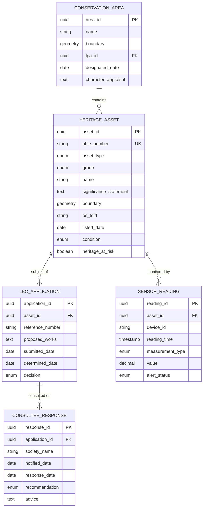

# Project Requirements: Heritage Asset Management

> **Template Origin**: Official | **ArcKit Version**: 4.6.1 | **Command**: `/arckit.requirements`

## Document Control

| Field | Value |
|-------|-------|
| **Document ID** | ARC-004-REQ-v1.0 |
| **Document Type** | Requirements Specification |
| **Project** | Heritage Asset Management (Project 004) |
| **Classification** | OFFICIAL |
| **Status** | DRAFT |
| **Version** | 1.0 |
| **Created Date** | 2026-03-28 |
| **Last Modified** | 2026-03-28 |
| **Review Cycle** | Quarterly |
| **Next Review Date** | 2026-06-28 |
| **Owner** | SRO, Heritage Asset Management Programme |
| **Reviewed By** | PENDING |
| **Approved By** | PENDING |
| **Distribution** | Heritage Asset Management Programme Board, DCMS, Historic England, CDDO |

## Revision History

| Version | Date | Author | Changes | Approved By | Approval Date |
|---------|------|--------|---------|-------------|---------------|
| 1.0 | 2026-03-28 | ArcKit AI | Initial creation from `/arckit.requirements` command | PENDING | PENDING |

## Document Purpose

This document defines requirements for the Heritage Asset Management platform — a digital system for managing the National Heritage List for England (NHLE), streamlining Listed Building Consent workflows, integrating IoT structural monitoring, and providing authoritative heritage data to the planning system (Project 002).

---

## Executive Summary

### Business Context

England has approximately 400,000 listed buildings, 20,000 scheduled monuments, 1,700 registered parks and gardens, 46 registered battlefields, and 33 World Heritage Sites. The National Heritage List for England (NHLE), maintained by Historic England, contains records for all these assets but many entries date from the 1947-1970 resurvey with imprecise spatial data, inconsistent descriptions, and no photographs. Heritage crime causes an estimated £2 billion in damage annually, much of it from planning decisions made without adequate heritage data. Conservation officer numbers have declined 35% since 2006, with remaining officers overwhelmed by administrative tasks.

### Objectives

- Digitise and validate 100% of NHLE records with accurate spatial boundaries (polygons)
- Reduce Listed Building Consent determination time by 30% through workflow automation
- Integrate heritage data with Urban Planning Analytics (Project 002) for automated constraint checking
- Deploy IoT structural monitoring at 500 Heritage at Risk sites via Project 001
- Provide API access to authoritative heritage data for all consuming systems

### Expected Outcomes

- 100% NHLE records with validated polygon boundaries within 3 years (50% in Year 1)
- 30% reduction in LBC determination time (from 12 weeks to 8.4 weeks)
- Zero heritage constraint oversights in planning decisions using the platform
- 500 Heritage at Risk sites with IoT structural monitoring

### Project Scope

**In Scope**:
- NHLE data digitisation, validation, and polygon boundary creation
- Listed Building Consent workflow management
- Statutory consultee notification and response tracking (amenity societies)
- Heritage at Risk Register integration
- IoT structural monitoring integration (vibration, moisture, temperature sensors from Project 001)
- Heritage data API for planning system integration (Project 002)
- Heritage crime evidence repository
- Conservation Area boundary management

**Out of Scope**:
- Ecclesiastical exemption cases (Church of England DAC process)
- Archaeological field survey and excavation management
- Heritage tourism and visitor management
- Building conservation technical guidance library

---

## Business Requirements

### BR-001: NHLE Data Digitisation and Spatial Accuracy

**Description**: Complete digital validation and accurate spatial boundary mapping (polygon, not point) for all NHLE entries, ensuring that heritage constraint data used in planning decisions is spatially precise and legally defensible.

**Rationale**: Current NHLE spatial data is a point (pin) for ~60% of entries, insufficient for planning constraint analysis. Planning decisions based on imprecise heritage data risk either missing constraints (allowing harm) or over-constraining development (blocking legitimate proposals).

**Success Criteria**:
- 100% of NHLE entries have validated polygon boundaries within 3 years
- Spatial accuracy of <1m for building footprints (aligned with OS MasterMap TOID)
- Data quality error rate <0.1% (legal consequence of errors)
- Heritage significance statements reviewed and updated for entries with insufficient descriptions

**Priority**: MUST_HAVE
**Stakeholder**: Historic England, Conservation Officers

---

### BR-002: Listed Building Consent Workflow Automation

**Description**: Provide an end-to-end digital workflow for Listed Building Consent applications, from submission through statutory consultation, assessment, determination, and enforcement monitoring.

**Rationale**: LBC applications require specific statutory processes including amenity society consultation. Current processes are largely manual (email/post), with conservation officers tracking responses in spreadsheets. Automation reduces administrative time, ensures no statutory step is missed, and provides an audit trail.

**Success Criteria**:
- LBC determination time reduced by 30% (from 12 weeks to 8.4 weeks)
- 100% of required statutory consultees notified automatically within 1 working day
- Response tracking with automated reminders at 14 and 19 days
- Full audit trail of all workflow steps, consultations, and decisions

**Priority**: MUST_HAVE
**Stakeholder**: Conservation Officers, Amenity Societies

---

### BR-003: Heritage Data API for Planning Integration

**Description**: Provide a real-time API exposing authoritative heritage constraint data (listed buildings, conservation areas, scheduled monuments, registered parks and gardens) to the Urban Planning Analytics platform (Project 002) and other consuming systems.

**Rationale**: Planning system integration requires real-time, machine-readable access to heritage data. The API must be the single source of truth for heritage constraints in planning decisions.

**Success Criteria**:
- API available with 99.9% uptime
- Response time <200ms at p95 for point-in-polygon constraint queries
- Data currency: changes reflected in API within 1 hour of NHLE update
- API consumers include Project 002 and at least 20 local planning authorities directly

**Priority**: MUST_HAVE
**Stakeholder**: Historic England, DLUHC Planning Directorate, Project 002

---

### BR-004: Heritage at Risk IoT Monitoring

**Description**: Integrate IoT structural monitoring sensors (vibration, moisture, temperature) from Project 001 with the Heritage at Risk Register, providing automated alerting when sensor readings indicate structural change, water ingress, or potential unauthorised works.

**Rationale**: Current Heritage at Risk monitoring relies on annual manual inspections. IoT sensors enable continuous monitoring and early warning, potentially preventing catastrophic loss. The Grenfell inquiry has heightened scrutiny of building monitoring.

**Success Criteria**:
- 500 priority Heritage at Risk sites with active IoT monitoring within 18 months
- Alerts generated within 1 hour of anomalous sensor readings
- Integration with heritage crime evidence repository for enforcement support
- Reduction in Heritage at Risk Register entries by 5% (demonstrating proactive intervention)

**Priority**: SHOULD_HAVE
**Stakeholder**: Historic England Heritage at Risk Team, Heritage Crime Prevention

---

## Functional Requirements

### User Personas

#### Persona 1: Conservation Officer

- **Role**: Assesses heritage impact, manages LBC applications, monitors heritage condition
- **Goals**: Efficient LBC workflow, accurate heritage data, early warning of heritage at risk
- **Pain Points**: Manual consultee tracking, incomplete NHLE data, split across multiple authorities
- **Technical Proficiency**: Medium

#### Persona 2: Historic England Listing Inspector

- **Role**: Maintains NHLE records, assesses listing applications, validates data quality
- **Goals**: Accurate, complete NHLE records with defensible spatial data
- **Pain Points**: Legacy data quality, backlog of records needing spatial validation
- **Technical Proficiency**: Medium-High

#### Persona 3: Amenity Society Caseworker

- **Role**: Reviews LBC applications, provides expert conservation advice
- **Goals**: Timely notification with adequate information, efficient response submission
- **Pain Points**: Inconsistent notification quality, no feedback on how advice was considered
- **Technical Proficiency**: Low-Medium (volunteers)

---

### Functional Requirements Detail

#### FR-001: NHLE Record Management

**Description**: Provide a comprehensive record management system for NHLE entries including spatial boundary editing, significance statement management, photographic record, and grade/type classification.

**Relates To**: BR-001

**Acceptance Criteria**:
- [ ] Given an NHLE record with a point location, when a polygon boundary is digitised from OS MasterMap, then the record is updated with the polygon and linked to the OS TOID
- [ ] Given an NHLE record, when the significance statement is edited, then a full version history is maintained with author attribution
- [ ] Given a new listing, when created, then all mandatory fields are enforced (list entry number, grade, asset type, location, significance statement, boundary)

**Priority**: MUST_HAVE
**Complexity**: HIGH

---

#### FR-002: Listed Building Consent Workflow

**Description**: End-to-end digital workflow for LBC applications from registration to determination, with automated statutory consultee notification, response tracking, and decision recording.

**Relates To**: BR-002

**Acceptance Criteria**:
- [ ] Given an LBC application involving demolition, when registered, then all six national amenity societies are notified within 1 working day with application details, photographs, and heritage significance statement
- [ ] Given a consultee response deadline of 21 days, when 14 days have passed without response, then an automated reminder is sent
- [ ] Given a determined LBC application, when the decision is recorded, then the decision notice references all consultee responses and how they influenced the determination

**Priority**: MUST_HAVE
**Complexity**: MEDIUM

---

#### FR-003: Heritage Constraint API

**Description**: RESTful API providing real-time heritage constraint data including point-in-polygon queries, buffer searches, and full asset record retrieval.

**Relates To**: BR-003

**Acceptance Criteria**:
- [ ] Given a point coordinate, when queried against NHLE, then all heritage assets within a configurable buffer (default 100m) are returned with grade, type, and significance summary
- [ ] Given a polygon (planning application site boundary), when queried, then all heritage assets intersecting or within the buffer are returned
- [ ] Given a listed building NHLE number, when queried, then the full record including boundary, significance statement, photographs, and listing history is returned

**Priority**: MUST_HAVE
**Complexity**: MEDIUM

---

#### FR-004: Heritage at Risk Sensor Integration

**Description**: Ingest and process IoT sensor data from Project 001 for heritage sites, with configurable alerting thresholds for vibration, moisture, and temperature anomalies.

**Relates To**: BR-004

**Acceptance Criteria**:
- [ ] Given vibration sensors at a listed building, when readings exceed the configurable threshold (default: 5mm/s PPV), then an alert is generated within 1 hour
- [ ] Given moisture sensors in a heritage structure, when readings indicate water ingress (sustained readings >80% RH), then a condition alert is raised
- [ ] Given a heritage at risk site with IoT monitoring, when all sensor readings are normal for 12 months, then the condition assessment is flagged for positive review

**Priority**: SHOULD_HAVE
**Complexity**: HIGH

---

#### FR-005: Heritage Crime Evidence Repository

**Description**: Maintain timestamped photographic evidence, sensor data records, and listing documentation to support heritage crime enforcement and prosecution.

**Relates To**: BR-004

**Acceptance Criteria**:
- [ ] Given a heritage asset, when a photographic survey is uploaded, then images are geotagged, timestamped, and cryptographically hashed for evidence integrity
- [ ] Given an enforcement case, when evidence is requested, then a complete evidence package (listing record, photographs, sensor data, timeline) is generated
- [ ] Given IoT sensor anomaly data, when exported for enforcement, then the data includes chain-of-custody metadata

**Priority**: COULD_HAVE
**Complexity**: MEDIUM

---

## Non-Functional Requirements

### Performance Requirements

#### NFR-P-001: Heritage Constraint API Response Time

**Requirement**: Point-in-polygon constraint queries must respond within 200ms at p95. Full record retrieval within 500ms at p95.

**Priority**: HIGH

---

### Availability Requirements

#### NFR-A-001: NHLE API Availability

**Requirement**: Heritage constraint API must achieve 99.9% availability (critical dependency for planning system).

**Priority**: CRITICAL

---

### Data Quality Requirements

#### NFR-DQ-001: NHLE Data Accuracy

**Requirement**: Spatial boundary data must be accurate to within 1m of the actual heritage asset footprint, aligned with OS MasterMap TOIDs. Error rate must not exceed 0.1% (legal consequence of inaccuracy).

**Priority**: CRITICAL

---

### Compliance Requirements

#### NFR-C-001: Planning (Listed Buildings and Conservation Areas) Act 1990

**Requirement**: All LBC workflows must comply with statutory requirements of the 1990 Act, including consultation periods, notification requirements, and decision recording obligations.

**Priority**: CRITICAL

---

## Integration Requirements

### INT-001: Integration with Urban Planning Analytics (Project 002)

**Purpose**: Provide heritage constraint data for automated planning constraint checking.
**Integration Type**: Real-time API (RESTful, GeoJSON responses)
**Data Exchanged**: Listed buildings, conservation areas, scheduled monuments, RPGs with polygons
**Priority**: MUST_HAVE

---

### INT-002: Integration with IoT Platform (Project 001)

**Purpose**: Receive structural monitoring sensor data for Heritage at Risk sites.
**Integration Type**: Event-driven (sensor telemetry stream) + API (historical data)
**Data Exchanged**: Vibration, moisture, temperature readings from heritage site sensors
**Priority**: SHOULD_HAVE

---

### INT-003: Integration with Ordnance Survey

**Purpose**: OS MasterMap TOIDs for spatial boundary alignment.
**Integration Type**: API (OS Data Hub)
**Data Exchanged**: Building footprints, TOIDs, address data
**Priority**: MUST_HAVE

---

## Data Requirements

### Heritage Data Model

---

## Constraints and Assumptions

### Technical Constraints

**TC-1**: NHLE entries are legal instruments — any system that modifies listing data must maintain complete audit history and version control.
**TC-2**: Heritage data API must serve as the single source of truth — consuming systems must not cache heritage data beyond 24 hours.
**TC-3**: Spatial data must align with OS MasterMap TOIDs for building identification.

### Business Constraints

**BC-1**: Budget cap of £8M capital over 3 years (DCMS allocation).
**BC-2**: Amenity society consultation periods (21 days) are statutory and cannot be shortened by technology.
**BC-3**: Heritage assessment remains a professional judgement — platform must support, not automate, conservation officer decisions.

---

## External References

| Document | Type | Source | Key Extractions | Path |
|----------|------|--------|-----------------|------|
| Planning (Listed Buildings and Conservation Areas) Act 1990 | Legislation | legislation.gov.uk | LBC requirements | N/A — external reference |
| NHLE Data Services | API | Historic England | Heritage data access | N/A — external reference |
| Heritage at Risk Register | Dataset | Historic England | Priority heritage assets | N/A — external reference |

---

**Generated by**: ArcKit `/arckit.requirements` command
**Generated on**: 2026-03-28
**ArcKit Version**: 4.6.1
**Project**: Heritage Asset Management (Project 004)
**Model**: Claude Opus 4.6
