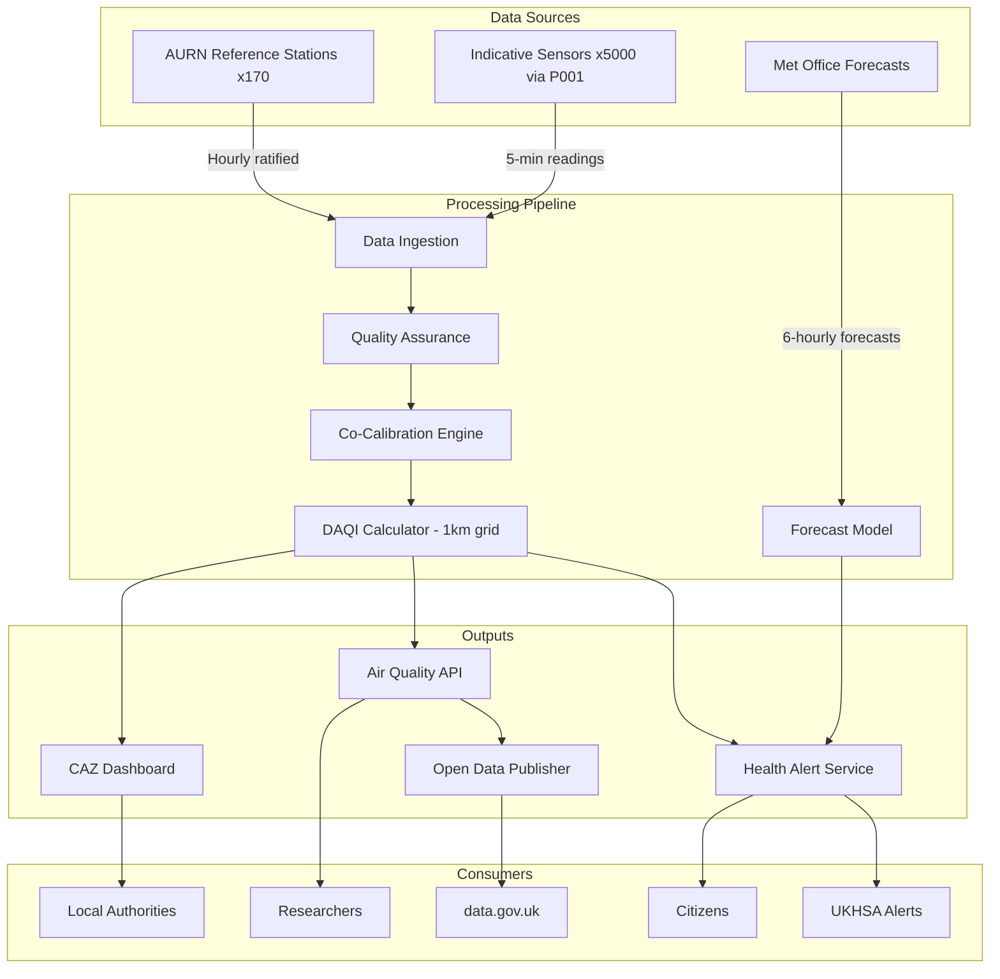

# Project Requirements: Air Quality Monitoring Network

> **Template Origin**: Official | **ArcKit Version**: 4.6.1 | **Command**: `/arckit.requirements`

## Document Control

| Field | Value |
|-------|-------|
| **Document ID** | ARC-005-REQ-v1.0 |
| **Document Type** | Requirements Specification |
| **Project** | Air Quality Monitoring Network (Project 005) |
| **Classification** | OFFICIAL |
| **Status** | DRAFT |
| **Version** | 1.0 |
| **Created Date** | 2026-03-28 |
| **Last Modified** | 2026-03-28 |
| **Review Cycle** | Quarterly |
| **Next Review Date** | 2026-06-28 |
| **Owner** | SRO, Air Quality Monitoring Network Programme |
| **Reviewed By** | PENDING |
| **Approved By** | PENDING |
| **Distribution** | Air Quality Monitoring Programme Board, DEFRA, UKHSA, Environment Agency, CDDO |

## Revision History

| Version | Date | Author | Changes | Approved By | Approval Date |
|---------|------|--------|---------|-------------|---------------|
| 1.0 | 2026-03-28 | ArcKit AI | Initial creation from `/arckit.requirements` command | PENDING | PENDING |

## Document Purpose

This document defines requirements for the Air Quality Monitoring Network — a real-time air pollution monitoring and alerting platform integrating DEFRA's AURN reference-grade network with validated lower-cost sensor networks and public health alerting systems.

---

## Executive Summary

### Business Context

Air pollution causes an estimated 28,000-36,000 premature deaths annually in the UK (COMEAP). The UK has legally binding air quality targets under the Environment Act 2021 (PM2.5 annual mean of 10 ug/m3 by 2040) and retained EU Ambient Air Quality Directive limits. DEFRA's AURN network provides high-quality reference-grade data but has only ~170 stations nationally — insufficient for the hyperlocal monitoring needed for Clean Air Zone enforcement, public health alerting, and environmental justice analysis. Over 40 local authorities have declared Air Quality Management Areas, and 8 cities operate Clean Air Zones. Compliance monitoring data is evidence in legal proceedings (ClientEarth litigation). The platform must bridge the gap between scientific rigour and coverage ambition.

### Objectives

- Integrate AURN reference-grade stations with 5,000+ validated lower-cost sensors via peer-reviewed data fusion algorithms
- Deliver real-time air quality health alerts within 5 minutes of threshold exceedance at 1km resolution
- Support Clean Air Zone compliance monitoring for 30+ local authorities
- Publish all air quality data as open data on data.gov.uk with INSPIRE-compliant metadata
- Achieve measurement uncertainty within accepted limits for regulatory reporting (MCERTS compliance for reference stations)

### Expected Outcomes

- 5,170+ monitoring points nationally (170 AURN + 5,000 validated indicative sensors)
- 5-minute alert latency (vs. current hourly DAQI updates)
- 1km spatial resolution for health alerts (vs. current city-average)
- 30+ local authorities using platform for CAZ/AQMA compliance monitoring
- All data published as open data with quality flags and uncertainty metadata

### Project Scope

**In Scope**:
- AURN reference station data integration and quality assurance
- Lower-cost sensor network integration via IoT Platform (Project 001)
- Data fusion algorithms (co-calibration of indicative sensors against reference stations)
- Real-time Daily Air Quality Index (DAQI) calculation at 1km resolution
- UKHSA health alert integration (push notifications, SMS, API)
- Clean Air Zone compliance monitoring data services
- Open data publication pipeline (data.gov.uk, INSPIRE)
- Pollutant modelling and forecasting (NO2, PM2.5, PM10, O3)
- Historical data archive and trend analysis API

**Out of Scope**:
- Procurement or deployment of physical sensors (IoT Platform Project 001 or local authority responsibility)
- Clean Air Zone charging systems (DfT/local authority)
- Indoor air quality monitoring
- Industrial emissions monitoring (Environment Agency MCERTS industrial)
- Noise pollution monitoring (separate initiative)

---

## Business Requirements

### BR-001: Reference-Grade and Indicative Sensor Data Fusion

**Description**: Integrate AURN reference-grade monitoring data with lower-cost indicative sensor data through validated data fusion algorithms, providing calibrated air quality estimates at spatial resolution not achievable by reference stations alone.

**Rationale**: Reference-grade AURN stations cost £100-150K each and number only 170 nationally. Lower-cost sensors (£500-5,000) can provide dense coverage but have lower accuracy. Data fusion — calibrating indicative sensors against nearby reference stations — combines the accuracy of reference with the coverage of indicative sensors.

**Success Criteria**:
- 5,000+ validated indicative sensors integrated with 170 AURN reference stations
- Data fusion algorithm peer-reviewed by NPL and published
- Calibrated indicative sensor readings within +/-25% of co-located reference station readings (DEFRA equivalence criterion)
- Clear data quality flags distinguishing reference-grade from calibrated indicative data

**Priority**: MUST_HAVE
**Stakeholder**: DEFRA Chief Scientific Adviser, Environment Agency, NPL

---

### BR-002: Real-Time Health Alerting

**Description**: Calculate the Daily Air Quality Index (DAQI) at 1km grid resolution in near-real-time and deliver health alerts to vulnerable populations within 5 minutes of a threshold exceedance.

**Rationale**: The Ella Adoo-Kissi-Debrah Coroner's ruling established a legal precedent for the duty to warn about dangerous air pollution. Current hourly, city-average DAQI is insufficient for hyperlocal alerting. Vulnerable individuals need timely, localised information.

**Success Criteria**:
- DAQI calculated at 1km resolution every 5 minutes
- Alert delivery to subscribed citizens within 5 minutes of threshold exceedance
- Alert channels: push notification, SMS, API, GOV.UK
- False positive rate <5% (avoiding alert fatigue)
- False negative rate <1% (safety-critical — must not miss genuine exceedances)

**Priority**: MUST_HAVE
**Stakeholder**: UKHSA, Asthma + Lung UK, Citizens

---

### BR-003: Clean Air Zone Compliance Monitoring

**Description**: Provide validated air quality monitoring data (NO2, PM2.5, PM10) to local authorities for Clean Air Zone compliance monitoring and Air Quality Management Area assessment.

**Rationale**: 8 cities operate CAZs, and 40+ authorities have AQMAs. They need validated, attributable air quality data accepted by DEFRA for annual status reports and by courts for enforcement.

**Success Criteria**:
- 30+ local authorities using platform data for CAZ/AQMA monitoring within 18 months
- Data accepted by DEFRA for LAQM annual status report submissions
- Spatial coverage sufficient for CAZ boundary monitoring (minimum 1 sensor per km of CAZ boundary)
- Trend analysis showing impact of CAZ on air quality at boundary locations

**Priority**: MUST_HAVE
**Stakeholder**: Clean Air Zone Cities, DEFRA Air Quality Team

---

### BR-004: Open Data Publication with INSPIRE Compliance

**Description**: Publish all air quality monitoring data as open data on data.gov.uk with INSPIRE-compliant metadata, clear data quality indicators, and historical archive access.

**Rationale**: Environmental Information Regulations 2004 require publication. Open data enables independent scrutiny (ClientEarth), academic research (Imperial/Kings), community monitoring, and third-party application development.

**Success Criteria**:
- All monitoring data published on data.gov.uk under OGL within 12 months
- INSPIRE-compliant metadata for all geospatial datasets
- Real-time API with documented schema
- Historical archive (minimum 10 years) queryable via API
- Data quality flags on every reading (reference, calibrated indicative, raw indicative)

**Priority**: MUST_HAVE
**Stakeholder**: DEFRA Data Team, ClientEarth

---

## Functional Requirements

### User Personas

#### Persona 1: DEFRA Air Quality Scientist

- **Role**: Manages AURN network, validates data quality, produces compliance reports
- **Goals**: Scientifically robust monitoring data, defensible compliance assessments
- **Pain Points**: Integrating heterogeneous sensor networks, maintaining MCERTS accreditation
- **Technical Proficiency**: High

#### Persona 2: Local Authority Environmental Health Officer

- **Role**: Monitors local air quality, manages AQMA, reports to DEFRA
- **Goals**: Affordable, validated local monitoring data for CAZ compliance and LAQM reporting
- **Pain Points**: AURN station too far away for local assessment, lower-cost sensor data quality uncertain
- **Technical Proficiency**: Medium

#### Persona 3: Citizen with Respiratory Condition

- **Role**: Checks air quality before outdoor activities, needs alerts on high pollution days
- **Goals**: Accurate, timely, localised air quality information to protect health
- **Pain Points**: Current DAQI too slow (hourly) and too coarse (city-average)
- **Technical Proficiency**: Low

---

### Functional Requirements Detail

#### FR-001: AURN Data Ingestion and Quality Assurance

**Description**: Ingest real-time data from all AURN reference stations with automated quality assurance checks (range validation, inter-station consistency, instrument status monitoring).

**Relates To**: BR-001

**Acceptance Criteria**:
- [ ] Given an AURN station measurement, when received, then it is ingested, validated, and available via API within 5 minutes
- [ ] Given a measurement outside instrument range (e.g., NO2 > 1000 ug/m3), when detected, then it is flagged as suspect and excluded from DAQI calculations
- [ ] Given an AURN station offline, when 2 consecutive readings are missed, then an alert is generated to DEFRA network management

**Priority**: MUST_HAVE
**Complexity**: MEDIUM

---

#### FR-002: Indicative Sensor Data Fusion

**Description**: Apply co-calibration algorithms to lower-cost sensor data using nearest AURN reference station as ground truth, producing calibrated estimates with quantified uncertainty.

**Relates To**: BR-001

**Acceptance Criteria**:
- [ ] Given an indicative sensor within 10km of an AURN station, when co-calibration is applied, then the calibrated reading is within +/-25% of the reference value
- [ ] Given a calibrated indicative reading, when served via API, then the response includes uncertainty bounds, calibration method, and reference station used
- [ ] Given a sensor that drifts >30% from reference after calibration, when detected, then the sensor is flagged for recalibration and its readings are downgraded to "raw indicative"

**Priority**: MUST_HAVE
**Complexity**: HIGH

---

#### FR-003: Real-Time DAQI Calculation

**Description**: Calculate the Daily Air Quality Index at 1km grid resolution every 5 minutes, using data from reference and calibrated indicative stations with spatial interpolation.

**Relates To**: BR-002

**Acceptance Criteria**:
- [ ] Given air quality readings from all sources, when DAQI is calculated, then the result is available at 1km grid resolution within 5 minutes of the latest readings
- [ ] Given a grid cell with DAQI >= 7 (High), when the threshold is crossed, then a health alert is triggered within 30 seconds
- [ ] Given a grid cell with no sensors within 5km, when DAQI is calculated, then the cell is marked as "modelled estimate" with higher uncertainty

**Priority**: MUST_HAVE
**Complexity**: HIGH

---

#### FR-004: Health Alert Delivery

**Description**: Deliver air quality health alerts to subscribed citizens via push notification, SMS, and API when DAQI thresholds are exceeded in their location.

**Relates To**: BR-002

**Acceptance Criteria**:
- [ ] Given a citizen subscribed to alerts for their postcode, when DAQI >= 7 (High) in their 1km grid cell, then a push notification is delivered within 5 minutes
- [ ] Given a DAQI >= 10 (Very High), when detected, then SMS alerts are sent to all subscribers in affected area within 5 minutes
- [ ] Given an alert, when delivered, then it includes DAQI level, health advice (per COMEAP guidance), and expected duration based on forecast model

**Priority**: MUST_HAVE
**Complexity**: MEDIUM

---

#### FR-005: Clean Air Zone Monitoring Dashboard

**Description**: Provide local authority dashboards showing real-time and historical air quality data for CAZ boundary and AQMA monitoring locations, with trend analysis and compliance assessment.

**Relates To**: BR-003

**Acceptance Criteria**:
- [ ] Given a Clean Air Zone boundary, when the dashboard is viewed, then real-time readings from all monitoring points within/adjacent to the zone are displayed
- [ ] Given a pollutant limit value (e.g., NO2 annual mean 40 ug/m3), when the running annual mean approaches 90% of the limit, then a compliance warning is generated
- [ ] Given a monthly view, when selected, then trend charts show pollutant concentrations over time with CAZ launch date marked for impact assessment

**Priority**: MUST_HAVE
**Complexity**: MEDIUM

---

#### FR-006: Air Quality Forecasting

**Description**: Provide 48-hour air quality forecasts at 1km resolution using meteorological data, traffic models, and historical patterns.

**Relates To**: BR-002

**Acceptance Criteria**:
- [ ] Given current air quality data and Met Office weather forecast, when the forecast model runs, then 48-hour DAQI predictions are generated at 1km resolution
- [ ] Given a forecast, when compared to actual readings post-event, then forecast accuracy is >75% (correct DAQI band)
- [ ] Given a forecast of DAQI >= 7, when generated, then a pre-emptive advisory alert is sent to subscribers 12 hours in advance

**Priority**: SHOULD_HAVE
**Complexity**: HIGH

---

## Non-Functional Requirements

### Performance Requirements

#### NFR-P-001: Data Ingestion Latency

**Requirement**: AURN data ingested and available within 5 minutes. Indicative sensor data (via Project 001 IoT Platform) ingested within 2 minutes. DAQI calculation completed within 3 minutes of data availability.

**Priority**: CRITICAL

---

#### NFR-P-002: Alert Delivery Latency

**Requirement**: End-to-end alert delivery (sensor reading to citizen notification) within 5 minutes for DAQI >= 7, within 2 minutes for DAQI >= 10 (Very High).

**Priority**: CRITICAL

---

### Availability Requirements

#### NFR-A-001: Monitoring Platform Availability

**Requirement**: Data ingestion and DAQI calculation pipeline: 99.95% availability (safety-critical public health function). API and alerting: 99.9%. Dashboards: 99.5%.

**RTO**: 30 minutes (alerting pipeline), 2 hours (dashboards)
**RPO**: 0 (no data loss acceptable for compliance monitoring)

**Priority**: CRITICAL

---

### Data Quality Requirements

#### NFR-DQ-001: MCERTS Compliance

**Requirement**: All reference-grade station data must meet MCERTS (Monitoring Certification Scheme) standards. Data uncertainty documented per station per pollutant. Calibration records maintained and auditable.

**Priority**: CRITICAL

---

#### NFR-DQ-002: Indicative Sensor Data Quality

**Requirement**: Calibrated indicative sensor readings must be within +/-25% of co-located reference values. Sensors exceeding this threshold must be automatically flagged and excluded from DAQI calculations until recalibrated.

**Priority**: CRITICAL

---

### Compliance Requirements

#### NFR-C-001: Environment Act 2021 Air Quality Targets

**Requirement**: Platform must support monitoring and reporting against legally binding PM2.5 targets (annual mean 10 ug/m3 by 2040, interim 12 ug/m3) and retained EU limit values for NO2, PM10, SO2, and O3.

**Priority**: CRITICAL

---

#### NFR-C-002: Environmental Information Regulations 2004

**Requirement**: All environmental monitoring data must be published proactively as open data, accessible to the public without charge.

**Priority**: CRITICAL

---

## Integration Requirements

### INT-001: Integration with IoT Platform (Project 001)

**Purpose**: Ingest lower-cost sensor data from the shared IoT platform.
**Integration Type**: Event-driven (real-time sensor telemetry stream)
**Data Exchanged**: NO2, PM2.5, PM10, O3 readings with device ID, location, timestamp, quality flag
**Priority**: MUST_HAVE

---

### INT-002: Integration with AURN Data Feed

**Purpose**: Ingest reference-grade data from DEFRA's AURN network.
**Integration Type**: API (uk-air.defra.gov.uk data feed)
**Data Exchanged**: Ratified and provisional hourly pollutant concentrations from all AURN stations
**Priority**: MUST_HAVE

---

### INT-003: Integration with UKHSA Alerting Systems

**Purpose**: Deliver DAQI alerts and data to UKHSA for public health alerting.
**Integration Type**: API (real-time push) + event-driven (threshold alerts)
**Data Exchanged**: DAQI values, threshold exceedance events, health advisory recommendations
**Priority**: MUST_HAVE

---

### INT-004: Integration with Met Office

**Purpose**: Weather forecast data for air quality forecasting model.
**Integration Type**: API (Met Office DataPoint / DataHub)
**Data Exchanged**: Wind speed/direction, temperature, pressure, precipitation, atmospheric stability
**Priority**: SHOULD_HAVE

---

### INT-005: Integration with data.gov.uk

**Purpose**: Publish open data with INSPIRE metadata.
**Integration Type**: API (CKAN API)
**Data Exchanged**: Air quality datasets, INSPIRE-compliant spatial metadata
**Priority**: MUST_HAVE

---

## Data Requirements

### Air Quality Data Flow

---

## Constraints and Assumptions

### Technical Constraints

**TC-1**: AURN reference data is the authoritative source — platform cannot modify or override reference-grade readings.
**TC-2**: MCERTS accreditation requirements govern reference station data quality — cannot relax these standards.
**TC-3**: Data fusion algorithms must be peer-reviewed and published — not proprietary black-box methods.

### Business Constraints

**BC-1**: Budget cap of £22M capital over 3 years (DEFRA allocation including AURN maintenance).
**BC-2**: AURN station network cannot be reduced — expansion only.
**BC-3**: Open data publication is a legal obligation (EIR 2004) — cannot be deferred.

### Assumptions

**A-1**: IoT Platform (Project 001) provides reliable sensor telemetry with device management.
**A-2**: Lower-cost sensors maintain calibration stability for 6+ months between recalibration.
**A-3**: Met Office DataHub API available for forecast data integration.

---

## External References

| Document | Type | Source | Key Extractions | Path |
|----------|------|--------|-----------------|------|
| Environment Act 2021 | Legislation | legislation.gov.uk | PM2.5 targets | N/A — external reference |
| Ambient Air Quality Directive 2008/50/EC | Legislation | legislation.gov.uk | Limit values | N/A — external reference |
| MCERTS Standards | Standard | Environment Agency | Monitoring certification | N/A — external reference |
| COMEAP Health Advice | Guidance | COMEAP | DAQI health messaging | N/A — external reference |
| R (ClientEarth) v SoS EFRA | Case law | Supreme Court | Legal air quality obligations | N/A — external reference |

---

**Generated by**: ArcKit `/arckit.requirements` command
**Generated on**: 2026-03-28
**ArcKit Version**: 4.6.1
**Project**: Air Quality Monitoring Network (Project 005)
**Model**: Claude Opus 4.6
